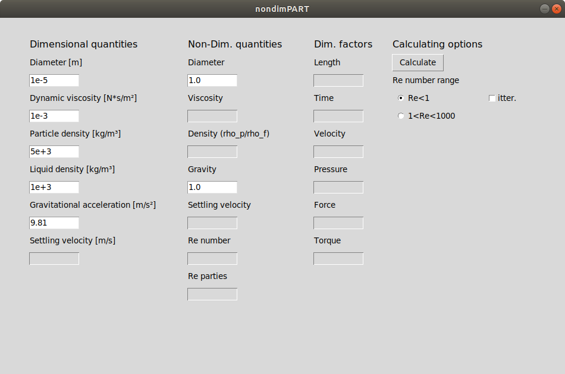

# nondimPART
## Basic description
This is a tool which halps to convert dimensional quantities of a system into non-dimensional units according to CFD code [PARTIES](https://github.com/vowinckel/PARTIES)
Source code is in the file "nondimPART.py"
## Table of contents
[Detailed description](description.md)

## How to run
You can run the app using - `python3 nondimPART.py`<br>
Or run executable file - `./dist/nondimPART`

## Download
To download the application use following commands:
```
$ cd $WORKDIR
$ git clone
```

## Theory
The only bad thing I found about Markdown (.md format) is that the additional steps are required to insert latex equations


it is only possible to insert them as figures, which you can generate, for example [here](http://www.sciweavers.org/free-online-latex-equation-editor)

## Figures
you can also put a figure in ypur repository and then use it here 



## Reference code
you also can reference a special part of your code using 

